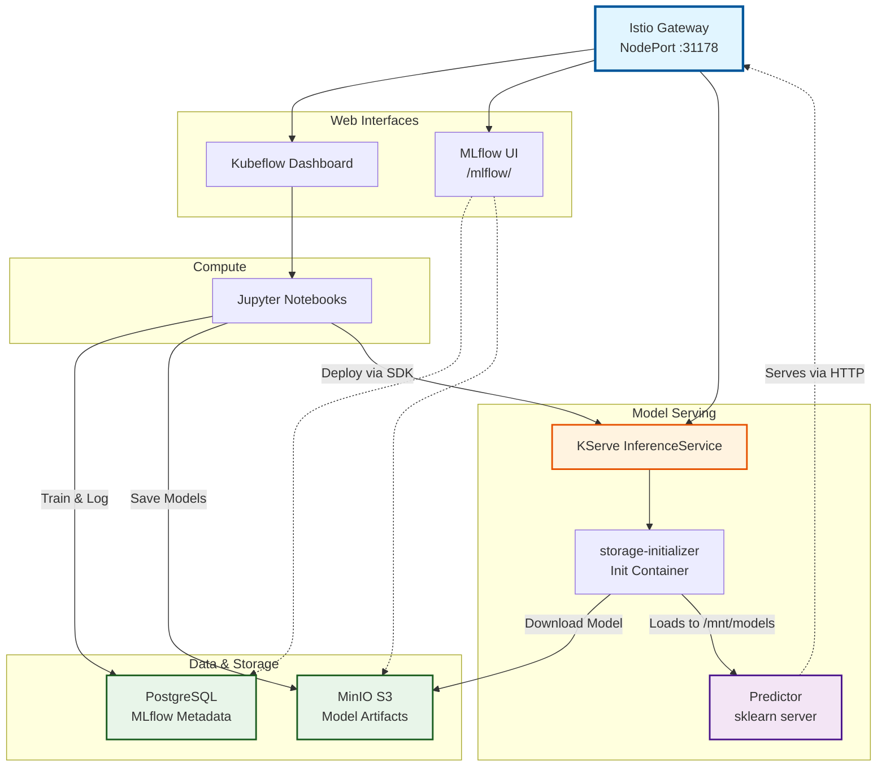

# ML Infrastructure on MicroK8s - MLflow + Kubeflow + KServe

**Production-ready MLOps platform combining MLflow experiment tracking, Kubeflow orchestration, and KServe model serving.**

---

## Platform Overview

### Kubeflow Dashboard with Jupyter Notebooks


### MLflow Experiment Tracking


### KServe Model Endpoints


---

## What's Deployed

**Kubeflow v1.8** - Complete ML platform (notebooks, pipelines, katib, kserve)  
**MLflow 2.9.2** - Experiment tracking and model registry  
**KServe** - Model serving with sklearn predictor  
**PostgreSQL 16** - MLflow metadata backend  
**MinIO** - S3-compatible artifact storage  
**Istio Gateway** - Unified ingress (NodePort 31178)  
**Authentication** Dex OIDC (user@example.com / 12341234)


## Quick Start

### Step 1: Deploy MLflow Stack

```bash
# 1. Create namespace
kubectl apply -f infrastructure/namespaces/mlflow-namespace.yaml

# 2. Create secrets (copy from templates first)
cp infrastructure/postgres/secrets.yaml.template infrastructure/postgres/secrets.yaml
cp infrastructure/minio/secrets.yaml.template infrastructure/minio/secrets.yaml
cp infrastructure/mlflow/secrets.yaml.template infrastructure/mlflow/secrets.yaml

# Edit secrets with your passwords, then apply:
kubectl apply -f infrastructure/postgres/
kubectl apply -f infrastructure/minio/
kubectl apply -f infrastructure/mlflow/

# 3. Verify MLflow pods are running
kubectl get pods -n mlflow
```

### Step 2: Deploy Kubeflow

```bash
# 1. Clone Kubeflow manifests (v1.8)
cd ~
git clone https://github.com/kubeflow/manifests.git
cd manifests
git checkout v1.8-branch

# 2. Install Kubeflow using kustomize
kustomize build example | kubectl apply -f -

# 3. Wait for all pods to be ready (~5-10 minutes)
kubectl get pods -n kubeflow
kubectl get pods -n istio-system
kubectl get pods -n auth

# 4. Expose Istio Gateway (NodePort)
kubectl patch svc istio-ingressgateway -n istio-system -p '{"spec":{"type":"NodePort"}}'

# 5. Get access port
kubectl get svc -n istio-system istio-ingressgateway
# Look for port 80:XXXXX (e.g., 80:31178)
```

### Step 3: Integrate MLflow with Kubeflow

```bash
# 1. Create MLflow VirtualService (routes /mlflow/ to MLflow)
kubectl apply -f infrastructure/mlflow/istio/virtualservice.yaml

# 2. Add MLflow tab to Kubeflow Dashboard
kubectl patch cm centraldashboard-config -n kubeflow --type='json' \
  --patch-file infrastructure/kubeflow/dashboard-mlflow-patch.json

# 3. Restart dashboard to apply changes
kubectl rollout restart deploy centraldashboard -n kubeflow

# 4. Fix CSRF issue for notebook creation (HTTP instead of HTTPS)
kubectl set env deployment/jupyter-web-app-deployment -n kubeflow APP_SECURE_COOKIES=false
```

### Step 4: Access the Platform

```bash
# Get NodePort for Istio Gateway
kubectl get svc -n istio-system istio-ingressgateway

# Access Kubeflow Dashboard at:
# http://<your-node-ip>:<nodeport>
# Example: http://172.20.10.2:31178

# Default credentials:
# Email: user@example.com
# Password: 12341234

# MLflow UI accessible at:
# http://<your-node-ip>:<nodeport>/mlflow/
```

---

## Test MLflow Integration

Create a Kubeflow Notebook and run:

```python
# Install MLflow
!pip install mlflow boto3

# Configure MLflow
import mlflow
import os

mlflow.set_tracking_uri("http://mlflow-service.mlflow.svc.cluster.local:5000")
os.environ["MLFLOW_S3_ENDPOINT_URL"] = "http://minio.mlflow.svc.cluster.local:9000"
os.environ["AWS_ACCESS_KEY_ID"] = "mlflow"
os.environ["AWS_SECRET_ACCESS_KEY"] = "mlflow123"

# Run experiment
from sklearn.ensemble import RandomForestRegressor
from sklearn.datasets import load_diabetes
from sklearn.metrics import mean_squared_error
from sklearn.model_selection import train_test_split
import pandas as pd

diabetes = load_diabetes()
X = pd.DataFrame(diabetes.data, columns=diabetes.feature_names)
y = diabetes.target
X_train, X_test, y_train, y_test = train_test_split(X, y, random_state=42)

with mlflow.start_run(run_name="test-run") as run:
    model = RandomForestRegressor(n_estimators=100, max_depth=5)
    model.fit(X_train, y_train)
    predictions = model.predict(X_test)
    
    mlflow.log_param("n_estimators", 100)
    mlflow.log_param("max_depth", 5)
    mlflow.log_metric("mse", mean_squared_error(y_test, predictions))
    mlflow.sklearn.log_model(model, "model")
    
    print(f"Run ID: {run.info.run_id}")
```

Check results in MLflow UI at `/mlflow/` path!

---

## KServe Model Deployment

**Deploy trained models directly from notebooks using KServe Python SDK!**

**Complete workflow**: [`examples/kserve-deployment-demo.ipynb`](examples/kserve-deployment-demo.ipynb)

### Quick Setup

```bash
# Create ServiceAccount with S3 credentials
kubectl apply -f infrastructure/kserve/storage-secret.yaml
kubectl apply -f infrastructure/kserve/serviceaccount.yaml
```

### Deploy in 4 Steps

```python
from kserve import KServeClient, V1beta1InferenceService
import mlflow

# 1. Train model with MLflow
mlflow.set_tracking_uri(os.environ['MLFLOW_TRACKING_URI'])
with mlflow.start_run() as run:
    model.fit(X_train, y_train)
    mlflow.sklearn.log_model(model, "model")
    storage_uri = f"{run.info.artifact_uri}/model"

# 2. Deploy with KServe SDK
kserve_client = KServeClient()
isvc = V1beta1InferenceService(...)
kserve_client.create(isvc)

# 3. Wait for ready
kserve_client.wait_isvc_ready(name, namespace)

# 4. Get predictions
response = requests.post(endpoint, json={"instances": data})
predictions = response.json()['predictions']
```

### Key Points

Uses environment variables from MLflow PodDefault  
KServe Python SDK (no YAML files needed)  
Direct MLflow artifact URIs  
**Note:** Use **scikit-learn 1.2.2** for compatibility  
**Note:** Enable **MLflow PodDefault** when creating notebook

---

## Project Structure

```
ml-infrastructure/
├── infrastructure/
│   ├── namespaces/
│   │   └── mlflow-namespace.yaml
│   ├── postgres/
│   │   ├── deployment.yaml
│   │   ├── service.yaml
│   │   ├── pvc.yaml
│   │   ├── secrets.yaml.template
│   │   └── secrets.yaml
│   ├── minio/
│   │   ├── deployment.yaml
│   │   ├── service.yaml
│   │   ├── pvc.yaml
│   │   ├── secrets.yaml.template
│   │   └── secrets.yaml
│   ├── mlflow/
│   │   ├── deployment.yaml
│   │   ├── Dockerfile
│   │   ├── service.yaml
│   │   ├── serviceaccount.yaml
│   │   ├── secrets.yaml.template
│   │   ├── secrets.yaml
│   │   └── istio/
│   │       └── virtualservice.yaml  # Routes /mlflow/ to MLflow service
│   ├── kubeflow/
│   │   ├── mlflow-poddefault.yaml
│   │   └── dashboard-mlflow-patch.json  # Adds MLflow tab to dashboard
│   └── kserve/                        # Model serving setup
│       ├── serviceaccount.yaml        # ServiceAccount with S3 credentials
│       ├── storage-secret.yaml        # MinIO credentials for storage-initializer
│       └── README.md                  # KServe documentation
├── scripts/
│   └── deploy-all.sh                  # Complete deployment automation
├── examples/
│   ├── kserve-deployment-demo.ipynb   # Complete KServe workflow
│   └── test_mflow.py.template
├── README.md
└── .gitignore
```

---

## Architecture

### High-Level Overview



### Detailed End-to-End Flow


#### Key Components Explained

**PostgreSQL**
- Stores MLflow experiment metadata ONLY
- NOT involved in predictions
- Contains: run_id, params, metrics, experiment tracking

**MinIO S3**
- Stores actual model artifacts (model.pkl, conda.yaml, etc.)
- Used in 2 phases:
  1. Training: MLflow saves models here
  2. Deployment: storage-initializer downloads from here

**storage-initializer**
- Init container (runs once at pod startup)
- Downloads model from MinIO to `/mnt/models/`
- Exits after download completes

**kserve-container (Predictor)**
- Main container (runs continuously)
- Loads model from `/mnt/models/`
- Serves HTTP predictions on port 8080
- Uses scikit-learn==1.2.2 for compatibility

**Kubernetes Service**
- Auto-created by KServe
- Provides stable DNS endpoint
- Load balances traffic to predictor pods

**ServiceAccount (kserve-sa)**
- Contains MinIO S3 credentials
- Mounted to pod via serviceAccountName
- Allows storage-initializer to authenticate

**Complete Workflow Summary:**
1. **Train** in Jupyter → MLflow logs to PostgreSQL (metadata) + MinIO (artifacts)
2. **Deploy** with KServe SDK → Creates pod with 2 containers
3. **Initialize** storage-initializer downloads model from MinIO once
4. **Serve** kserve-container loads model and serves predictions continuously
5. **Predict** any client sends HTTP POST → gets predictions back

---

## Resources

- [Kubeflow Documentation](https://www.kubeflow.org/docs/)
- [MLflow Documentation](https://mlflow.org/docs/latest/index.html)
- [KServe Documentation](https://kserve.github.io/website/)
- [MicroK8s Documentation](https://microk8s.io/docs)
- [Example Notebook](examples/kserve-deployment-demo.ipynb)

---


